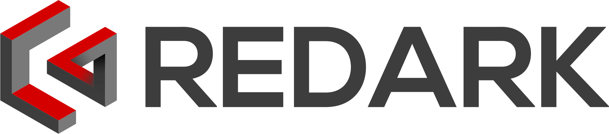

# Redark Next.js Blog

Redark is my own private blog dedicated to games and IT thematic. The blog has gone through several technological iterations:

- **2018-2020**: WordPress
- **2020-2025**: Gatsby - Blog theme and post content were transferred from WordPress to Gatsby technology. More information about this migration can be found in [this article](https://redark.pl/zegnaj-wordpressie).
- **2025**: Next.js - The blog was migrated to Next.js for improved performance and modern React features. However, this version was **never deployed to production** due to low traffic on the website and missing some functions compared to the current Gatsby version that remains live.

## Live Preview

The REDARKpl blog (Gatsby version) is available on [www.redark.pl](https://redark.pl).

## Features

- Custom visual elements in posts
- Automatic pagination
- Post slug and featured image support
- Post categories and tags support (like WordPress)
- Related posts under post content
- Empty category/tag detection
- MDX support for rich content

## Commands

To run the development server on port 3000 use:

```bash
npm run dev
# or
yarn dev
```

To build production version use:

```bash
npm run build
# or
yarn build
```

To start the production server use:

```bash
npm start
# or
yarn start
```

More information can be found in [official Next.js documentation](https://nextjs.org/docs)
